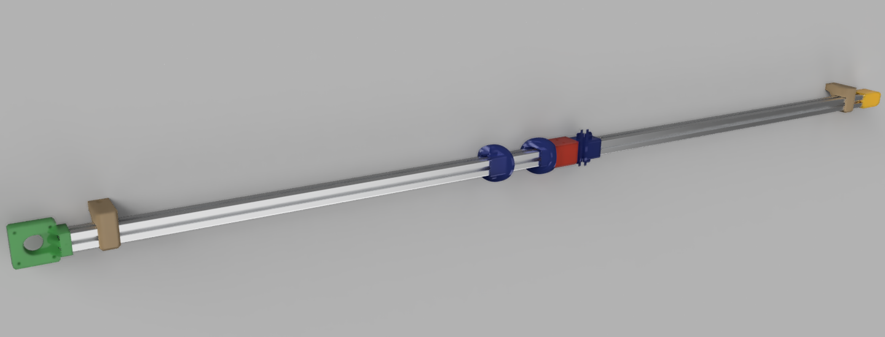

# Smart Curtain
This project is not yet complete.

## ABOUT

### DESCRIPTION

Smart Curtain is an automation of curtains to open curtains to a certain position either immediately, at a specified time, at a predicted time, or at sunrise/sunset. It can run as a Hub-Node (master-slave) system through a MQTT Broker. Other devices can control the Curtain through MQTT. The Hub runs using a Python (Flask) web server for the backend, a React frontend, a Postgres database for storing curtains, their states and user variables, and a python instance for automatic event creation & management. The Node runs Arduino compiled and bootloaded code. 


### FEATURES
- Control curtains either by all, home, room, or individually
- Immediate movement to a specified position (0–100%)
- Move to a position (0–100%) at a specified time
- Sunrise opening and sunset closing
- Event predition
- Device knows if it has been manually opened

#### Movement Functionality
-


### How It Works




### CONTENTS
- `~/3DModels` The 3-D Models for the SmartCurtain
- `~/Documentation` Descriptions, examples, & diagrams of this project
- `~/Hub/` The scripts for the Raspberry Pi/Hub system to server requests from user & nodes
- `~/Node/` The arduino program to query the Hub for action information.
- `~/Testing` Virtual devices & other scripts used for testing code/systems
- `.gitignore` SELF EXPLANATORY
- `README.md` SELF EXPLANATORY

### HARDWARE
- Raspberry Pi or linux computer with W/LAN capabilities
- Curtain Electronics
	- ESP32 dev board
	- Stepper Motor and Controller *(Nema 17 & TB 6600)*
	- 1 End Stop Sensor
	- 1 [12V to 5V Buck Inverter](https://www.amazon.com/dp/B01M5JFO0L/?coliid=I21ECWG54QVM97&colid=3Q91VWIGIBUKK)
	- 1 [12V Barrel Power Supply](https://www.amazon.com/dp/B06XTZPBXD/?coliid=IIEST6NP7UPD5&colid=3Q91VWIGIBUKK)
	- 1 [Female Barrel Socket](https://www.amazon.com/dp/B08271YLXZ/?coliid=I8X9UDJVCE92K&colid=3Q91VWIGIBUKK)
- Curtain Other Hardware
	- 20x20 extruded aluminum rod with 4 channels
	- 3D printed parts to make this sucker work
	- 2 [GT2 Timing Belt](https://www.amazon.com/dp/B07PGDBY8L/?coliid=I1ZPOZ4D0TO473&colid=3Q91VWIGIBUKK)
	- 2 [GT2 Pulley](https://www.amazon.com/dp/B07PGDBY8L/?coliid=I1ZPOZ4D0TO473&colid=3Q91VWIGIBUKK)
	- GT2 Belt Free Wheel

---

## INSTALLATION

### ARDUINO
- Install ESP32 board library `https://dl.espressif.com/dl/package_esp32_index.json`
- Install [ArduinoJson library](https://arduinojson.org/).
- Install [ArduinoMQTTClient library](https://github.com/arduino-libraries/ArduinoMqttClient).
- Open `~/SmartCurtain/Node/Node.ino` into Arduino IDE (or equivalent).
- Edit `src/Config.cpp.template` with appropriate values and save as `src/Config.cpp`.
- Compile & Bootload program to Arduino.

### RASPBERRY PI
*This assumes the Raspberry Pi has already been connected to the internet*
- Requires sudo generated sshkey (and the pubkey on github) if the git repo is cloned with ssh.
- Clone repository to Raspberry Pi.
- Edit `~/SmartCurtain/Hub/DB/Sample.sql` as needed for your setup.
- Edit `~/SmartCurtain/Hub/Python/Other/Global.py` to supply your locale & information.
- `cd` into `~/SmartCurtain/Hub/`.
- Run `make` command.

### HARDWARE SETUP
**Changed: do not trust instructions**

- Make sure hardware works individually (See diagrams below for specifics).
- Connect all devices to network and assemble curtain.

#### MOTOR
```
_
 |_
M  |----- Wire 1
o  |----- Wire 2
t  |
o  |----- Wire 3
r _|----- Wire 4
_|

```

#### DRIVER
```
_______
Ena - °|-------------------
Ena + °|–– ESP32 18 (GPIO) |
Dir - °|-------------------+---- ESP32 (GND)
Dir + °|–– ESP32 5  (GPIO) |
Pul - °|-------------------
Pul + °|–– ESP32 19 (GPIO)
B-    °|–– Wire 1
B+    °|–– Wire 2
A-    °|–– Wire 3
A+    °|–– Wire 4
V-    °|–– -
V+    °|–– +
–––––––
```


## UPDATE

### HUB

- `cd ~/SmartCurtain/Hub`
- `make update`

---


## NOTES

### INSTALLED EXTERNAL PACKAGES
- postgresdb
- python3:
	- requests
	- Flask
	- Flask-Cors
	- psycopg2
	- paho-mqtt
	- SQLAlchemy
	- astral==1.10.1


### DESIGN DECISIONS
- Options precedence is selected High -> Low from Curtain -> Home (because I am specifying that a specific item has precendence over a more general category).
- Events precedence is selected High -> Low from Home -> Curtain, as an event for an area includes more specific items in that area

---

## CONSIDERED FUTURE ADDITIONS
- [ ] 1. Google Calendar Event Setter
- [ ] 2. Thermostat & light level integration *(if it's cold & dark outside then close curtains for better insolation (and vice versa))*
- [ ] 3. Who Is Home (ping Android phones to see if person is on local network) closing/opening
- [x] 4. Update module automatically updates Hub nightly when origin/Production branch is updated.
- [ ] 5. Mobile App
- [ ] 6. WearOS App
- [x] 7. JSON Log format
- [x] 8. JSON string output for all objects
- [ ] 9. Updater can run bash script (using same principle as DB updates)

---

created by: MPZinke on 08.20.2018

edited by: MPZinke on 2020.12.28 to actually make it a README instead of a text file.

Remember that you're making this at your own accord and I take no responsibility for any mistakes or problems that may arise.

---

## Appendix
- Nema 17 has a step size of 1.8°/step or 200 steps/revolution [Source](https://www.makerguides.com/tb6600-stepper-motor-driver-arduino-tutorial/)
- TB6600 16x Micro stepping equates to ~80 steps/mm (I measured it to be ~80.5 steps/mm)
- [Example for AMT10](https://hackaday.io/project/9914-open-robotics-eurobot/log/34812-amt10-encoder-setup)
- [Example for Dual Core Arduino](https://randomnerdtutorials.com/esp32-dual-core-arduino-ide/)